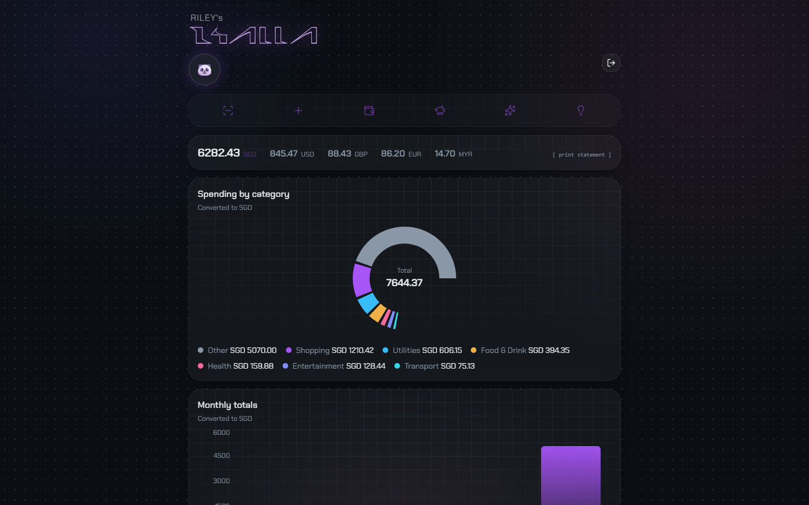
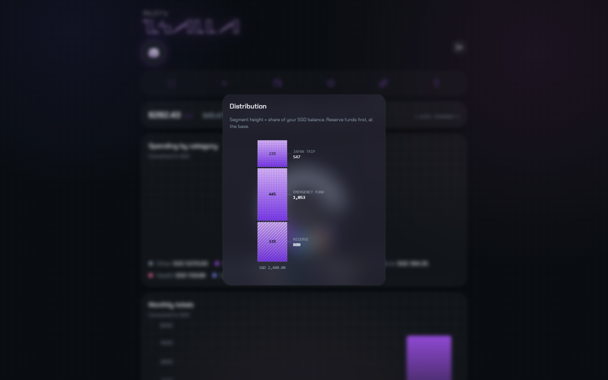
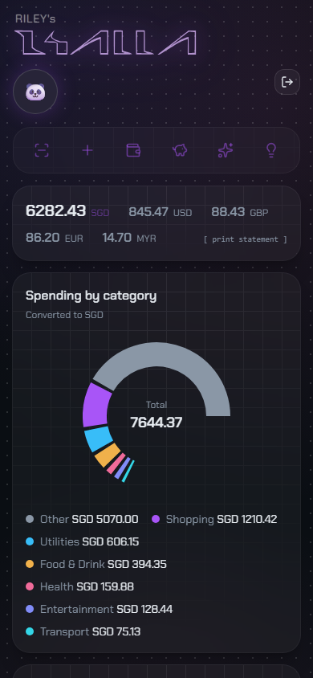
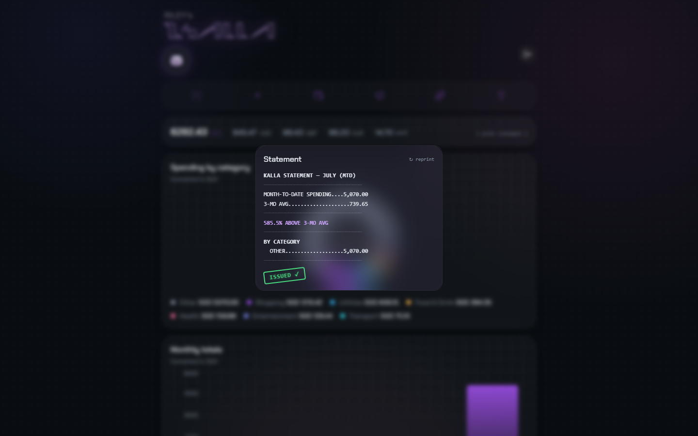

# KALLA

**A financial modeling system, not a receipt tracker.**

Most personal finance apps store a balance as a number and mutate it every time something happens. KALLA doesn't. Every balance you see is *derived* — computed on the fly from an immutable, append-only ledger of transactions, the same pattern double-entry bookkeeping and event-sourced systems have used for centuries. Nothing is ever overwritten. Nothing can silently drift out of sync with reality.

[**Live demo →**](https://mahanr3x06.com) · [Screenshots](#screenshots) · [Architecture](#architecture) · [Tech stack](#tech-stack)

  

---

## Why this architecture

Every mainstream budgeting app I looked at — including well-reviewed ones — stores balances the same way: a `Transaction` row with a mutable `amount` field, and an account total that gets incremented or decremented in place. I checked one popular iOS app's local database directly: five entities, a mutable `Transaction.amount`, no `Account` entity at all, budgets stored as independent numbers with no traceable link back to the transactions that produced them.

That works, until it doesn't. Edit a transaction after the fact and you've silently rewritten history. Ask "why is this account balance what it is" and there's no answer — the number just *is*, with no derivation you can audit or replay.

KALLA is built the other way round:

- **The ledger is the single source of truth.** Every transaction is an immutable, append-only entry — never updated, never deleted, only appended or reversed with a new offsetting entry.
- **Balances are derived, not stored.** An account's balance is the result of folding over its ledger entries, computed fresh each time. There is no `balance` column to drift out of sync with reality.
- **Every number is auditable.** Because nothing is mutated, you can always answer "how did we get here" by replaying the ledger — a property mutable-state apps structurally cannot offer.

This isn't a stylistic preference. It's the difference between an app that *shows* you a number and a system that can *prove* one.

---

## Screenshots

<!-- Add screenshots to /docs/screenshots and update the paths below.
     Suggested set: dashboard (desktop), floating dock hover state,
     allocation engine / savings distribution, mobile responsive view,
     the Statement receipt-print animation. -->

| Dashboard | Allocation engine |
|---|---|
|  |  |

| Mobile | Statement |
|---|---|
|  |  |

---

## Architecture

<!-- Diagram: ledger → derived balances → two-pass allocation engine.
     Build with the Visualizer and drop the exported image here, or
     keep as a text description if you'd rather not maintain an image. -->

```
Ingestion (CSV / OCR / PDF)
        │
        ▼
  Double-entry ledger  ──────►  Derived balances (computed, never stored)
   (immutable, append-only)              │
        │                                ▼
        │                     Two-pass allocation engine
        │                     ┌─────────────────────────┐
        │                     │ Pass 1 — fund reserves,  │
        │                     │  senior-first (emergency │
        │                     │  fund pinned at −1)      │
        │                     │ Pass 2 — spread remainder│
        │                     │  by strategy, cap-and-   │
        │                     │  redistribute overflow   │
        │                     └─────────────────────────┘
        ▼
  Reconciliation & reporting
   (Statement, Insights, dashboards)
```

### Core components

**Double-entry ledger.** Single source of truth. Every mutation is an event; balances are folds over the event log, not stored state.

**Two-pass allocation engine.** Pass 1 funds every reserve senior-first, with the emergency fund pinned at priority −1 so it's always filled before discretionary goals. Pass 2 spreads whatever remains according to the chosen strategy (waterfall, proportional, or even split), with cap-and-redistribute logic so overflow from a capped goal doesn't just vanish — it flows to the next eligible target.

**Source-agnostic ingestion pipeline.** CSV, PayNow OCR, and PDF statement adapters all feed the same ledger through one path. Deduplication runs on two keys: an exact match on source-native transaction ID (skip silently), and a content hash for cross-source collision flagging (surface for the user to decide). Counterparty names are salted per-user via HMAC before storage — no raw merchant-identity linkage across accounts. Raw uploaded artifacts (receipt images, statement PDFs) are ephemeral, not retained after processing.

**Security.** Argon2id password hashing, rate limiting via slowapi, email-verification-gated signup (credentials live in a signed JWT — no database write happens until the verification link is clicked, so unverified signups leave no trace), IDOR sweep clean, OCR prompt-injection fencing on extracted text, file upload validation, `/docs` disabled in production.

---

## Tech stack

| Layer | Choice |
|---|---|
| Backend | FastAPI, SQLAlchemy, PostgreSQL (prod) / SQLite (local) |
| Frontend | React + Vite, Tailwind CSS v4, shadcn/ui, Recharts |
| Auth | Argon2id, JWT, email verification via Resend |
| OCR | Google Vision |
| AI | OpenAI (insights pipeline — rework in progress, see Roadmap) |
| Deployment | Railway (backend), Vercel (frontend), Cloudflare Registrar (domain) |
| CI | GitHub Actions — ruff + pytest, 274+ tests |

---

## Getting started

```bash
git clone https://github.com/R3X06/receipt-scanner.git
cd receipt-scanner

# Backend
cd backend
pip install -r requirements.txt
python -c "import main"   # sanity check
uvicorn main:app --reload

# Frontend
cd ../frontend
npm install
npm run dev
```

Required environment variables (backend): `RESEND_API_KEY`, `FROM_EMAIL`, `FRONTEND_URL`, `ALLOWED_ORIGINS`, `ENVIRONMENT`. Frontend: `VITE_API_URL`.

---

## Roadmap

Queued, in dependency order — each gated behind the previous one shipping:

- **Scenario simulation** — run the existing deterministic allocation engine over hypothetical inputs without persisting anything, so you can ask "what if" without touching real data.
- **Awareness layer** — runway indicator, recurring/subscription detection, category-drift nudges.
- **Guidance layer** — a reworked AI insights pipeline: a deterministic snapshot layer (z-scores, recurring detection, outlier attribution) feeding a multi-stage model pipeline with a critic pass from a different model family, designed to prevent structural hallucination and degrade gracefully to templates rather than fail silently.
- **Split expenses / investment & tax tracking** — deferred pending a decision on whether these fit as new Account types or require new primitives entirely — the kind of question the ledger architecture was built to make answerable without a schema rewrite.

---

## License

<!-- Add your license here -->